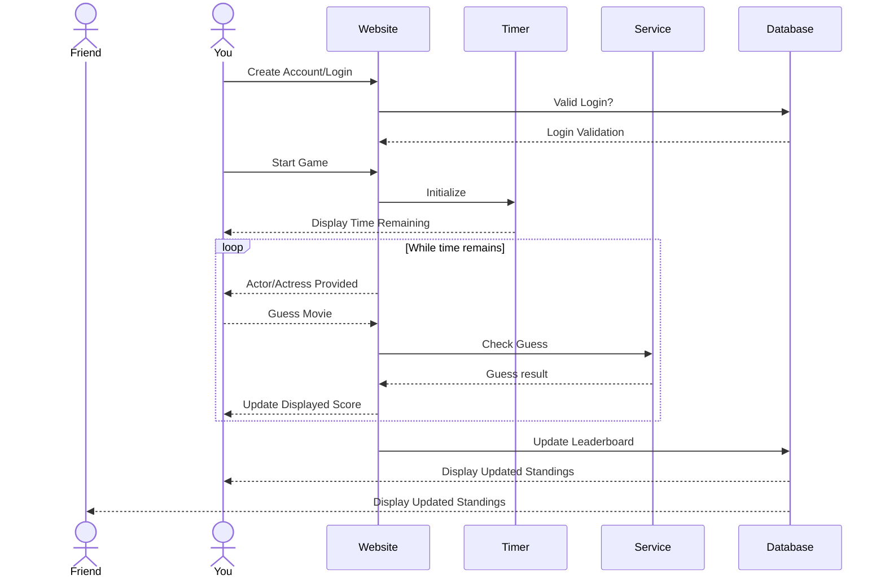

# Actordle

This Application is a web game patterned after the many games fashioned after the famous "Wordle." Users will be able to test their knowledge of cinema by naming as many movies a given actor/actress was featured in within a 1:30 time period. Results will be able to be shared, but will also be pushed to a live leaderboard, where scores from other users will be displayed.

## Specification Deliverable

For this deliverable I did the following. I checked the box `[x]` and added a description for things I completed.

- [x] Proper use of Markdown -- Most of the formatting in the .md file was pre-provided. However, minor tweaks and deletions were necessary to improve presentation and allow for the emphasis of certain words e.g. italics in the elevator pitch.
- [x] A concise and compelling elevator pitch -- This game should tailor to most audiences, but for my family in particular this will be a major competition. The inherent competition in the game should help users to continue using it.
- [x] Description of key features -- This list is surely not extensive, but that would be beyond the scope of this project. All major features that are central to the programs design are included.
- [x] Description of how you will use each technology -- All technologies have at least one implementation in the program, and though the list is not exhaustive, it includes major pivots for the project that are crucial to its functionality.
- [x] One or more rough sketches of your application. Images must be embedded in this file using Markdown image references. -- Images included below: Login screen, game screen, and leaderboard display.

### Elevator pitch

We've all met that one person who knows way too much about movies -- but how much do they really know? Actordle stretches your knowledge of cinema to the very limit by challenging users to name as many movies a given actor/actress was featured in. Climb the leaderboard and share your results to see who *actually* knows the classics best out of your friends and family.

### Design

### Key features

- Login for authentication and persistence of user data
- New actor/actress every day
- Option to share score after the game
- Auto-complete movie guesses to avoid spelling errors
- Local personal bests stored to compare with previous high scores
- Live leaderboard showing all players’ scores in real time

### Technologies

I am going to use the required technologies in the following ways.

- **HTML** - One primary HTML page which will serve as an entry point to the applicatoin. React will then manage the login, game, and leaderboard views.
- **CSS** - UI that is fitted to both PC and mobile, allowing for users to quickly play wherever they are, sufficient and appealing contrast as well as basic visual assets.
- **React** - Start/Stop timer, relays guesses to service, track previous guesses, and track frontend displayed score, displays leaderboard, handles switches between login, game, and leaderboard.
- **Service** - Provides endpoints for the following:
    - Login
    - Registration
    - Fetching details on actors/actresses and the movies they featured in (external: TMDB)
    - Choosing an actor/actress of the day
    - Validating guesses
    - Tracking and updating scores
    - retrieving the global leaderboard from the database.
- **DB/Login** - Stores global leaderboard, usernames, user data i.e. high scores, password hashes for login.
- **WebSocket** - As a user finishes a game their score is pushed to a live global leaderboard accessible to all other users.

## 🚀 AWS deliverable

For this deliverable I did the following. I checked the box `[x]` and added a description for things I completed.

- [ ] **Server deployed and accessible with custom domain name** - [My server link](https://yourdomainnamehere.click).

## 🚀 HTML deliverable

For this deliverable I did the following. I checked the box `[x]` and added a description for things I completed.

- [ ] **HTML pages** - I did not complete this part of the deliverable.
- [ ] **Proper HTML element usage** - I did not complete this part of the deliverable.
- [ ] **Links** - I did not complete this part of the deliverable.
- [ ] **Text** - I did not complete this part of the deliverable.
- [ ] **3rd party API placeholder** - I did not complete this part of the deliverable.
- [ ] **Images** - I did not complete this part of the deliverable.
- [ ] **Login placeholder** - I did not complete this part of the deliverable.
- [ ] **DB data placeholder** - I did not complete this part of the deliverable.
- [ ] **WebSocket placeholder** - I did not complete this part of the deliverable.

## 🚀 CSS deliverable

For this deliverable I did the following. I checked the box `[x]` and added a description for things I completed.

- [ ] **Visually appealing colors and layout. No overflowing elements.** - I did not complete this part of the deliverable.
- [ ] **Use of a CSS framework** - I did not complete this part of the deliverable.
- [ ] **All visual elements styled using CSS** - I did not complete this part of the deliverable.
- [ ] **Responsive to window resizing using flexbox and/or grid display** - I did not complete this part of the deliverable.
- [ ] **Use of a imported font** - I did not complete this part of the deliverable.
- [ ] **Use of different types of selectors including element, class, ID, and pseudo selectors** - I did not complete this part of the deliverable.

## 🚀 React part 1: Routing deliverable

For this deliverable I did the following. I checked the box `[x]` and added a description for things I completed.

- [ ] **Bundled using Vite** - I did not complete this part of the deliverable.
- [ ] **Components** - I did not complete this part of the deliverable.
- [ ] **Router** - I did not complete this part of the deliverable.

## 🚀 React part 2: Reactivity deliverable

For this deliverable I did the following. I checked the box `[x]` and added a description for things I completed.

- [ ] **All functionality implemented or mocked out** - I did not complete this part of the deliverable.
- [ ] **Hooks** - I did not complete this part of the deliverable.

## 🚀 Service deliverable

For this deliverable I did the following. I checked the box `[x]` and added a description for things I completed.

- [ ] **Node.js/Express HTTP service** - I did not complete this part of the deliverable.
- [ ] **Static middleware for frontend** - I did not complete this part of the deliverable.
- [ ] **Calls to third party endpoints** - I did not complete this part of the deliverable.
- [ ] **Backend service endpoints** - I did not complete this part of the deliverable.
- [ ] **Frontend calls service endpoints** - I did not complete this part of the deliverable.
- [ ] **Supports registration, login, logout, and restricted endpoint** - I did not complete this part of the deliverable.

## 🚀 DB deliverable

For this deliverable I did the following. I checked the box `[x]` and added a description for things I completed.

- [ ] **Stores data in MongoDB** - I did not complete this part of the deliverable.
- [ ] **Stores credentials in MongoDB** - I did not complete this part of the deliverable.

## 🚀 WebSocket deliverable

For this deliverable I did the following. I checked the box `[x]` and added a description for things I completed.

- [ ] **Backend listens for WebSocket connection** - I did not complete this part of the deliverable.
- [ ] **Frontend makes WebSocket connection** - I did not complete this part of the deliverable.
- [ ] **Data sent over WebSocket connection** - I did not complete this part of the deliverable.
- [ ] **WebSocket data displayed** - I did not complete this part of the deliverable.
- [ ] **Application is fully functional** - I did not complete this part of the deliverable.
